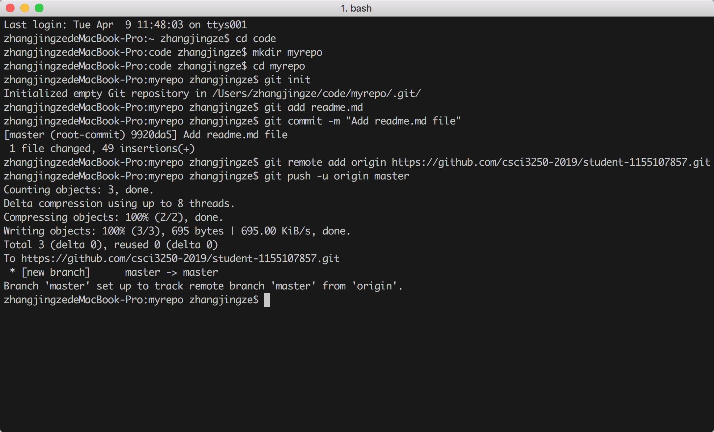

#__READ ME__

> ##Personal Information
>
> > | Name                | ZHANG Jingze           |
> > | ------------------- | ---------------------- |
> > | __SID__             | **1155107857**         |
> > | __Developing year__ | **2**                  |
> > | __Major__           | ***Computer Science*** |
> > | __Stream__          | ***N.A.***             |
>
> --------------------------
>
> ## Important Skills
>
> ```python
> #The important skills which I think is important for a developer
> ```
>
> > * __Math__
> > * __Programming__
> > * __Communication__
> > * __more … ___
>
> ## Some Interesting Github projects
>
> 1. [***awesome***][https://github.com/sindresorhus/awesome ]
> 2. [***pix2pix***][]
> 3. [***faceswap***][]
> 4. [***LeetCodeAnimation***][]

##What programming language have you learned?:blush:  (tick them)

- [ ] **C**

- [ ] **C++**

- [ ] **Python**

- [ ] **Java**

- [ ] **Javascript**

- [ ] **PHP**

  

# Others

> ##My screenshot for my git commands
>
> 


# Thank you! :blush:

